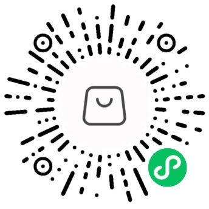

# 关于我

::: tip  

您当前浏览的是由vitepress生成的在线简历，
<a href="https://ali.fcbyk.com/file/张明良-简历.pdf" download>点击此处可下载PDF版本</a>

:::

Hello，我是不愉，**23年应届毕业生**，关于域名和昵称的由来请 [点击这里](/about/name)

## 教育背景
2018年始，在 **海南经贸职业技术学院** 学习 **计算机网络** 专业，学习了服务器搭建（Linux/Window）、计算机网络理论知识、网络设备互联（调试交换机，路由器）、Java编程，web前端等课程。在校期间通过了计算机二级考试。

2021年，通过统招专升本考试，在 **海南热带海洋学院** 学习 **计算机科学与技术** 专业，在此期间，系统学习了计算机基础知识（数据结构，计算机网络，计算机组成原理，操作系统，数据库等），同时参加了校内CTF竞赛，荣获三等奖。

::: details 实习经历
2020年7月-12月，在 **海南安一通信网络工程有限公司** 实习， **售后工程师** ，主要工作内容是负责海南省中石化监控系统、海口人大常委会机房的运维等。
:::

## 个人作品

**校园报修系统**（浏览器/服务器）：这个系统是学校数据库课程设计时写的，是一个学生报修，维修人员接单的一个系统。前端使用了Vue2和Element UI 组件库，后端使用Node操作MySQL数据库。该项目现已使用Docker部署至阿里云服务器，[点击访问](https://cr.fcbyk.com/#/)。

**线上逛店小程序**（小程序/服务器）：这是4月写的毕业设计，一个线下商品信息共享平台，每个人都可以发布商品信息。前端使用了微信小程序原生开发（TS+Less），后端使用了SpringBoot，MyBatisPlus等技术。本小程序已上线，搜索 **`zml的毕设`** 或扫描下方小程序码即可访问。

其他作品或未完成的作品请访问我的 [GitHub主页](https://github.com/fcbyk)

## 专业能力

本人技术栈已在后续列出，包括但不限于这些的技术，对计算机学科 <u>**有相对的广度，但缺乏深度**</u>。有一定写数据结构，写算法的能力，但较弱，也是目前的一个学习方向，偶尔会刷力扣。

<u>**善于使用工具和阅读文档**</u> 辅助开发，如使用ChatGPT解决遇到的问题，节省开发时间。使用Apifox写 [接口文档](https://goods-online.apifox.cn/)，进行接口调式。使用即时设计绘制 [前端页面的草稿](https://js.design/f/-O0fJs?p=NjuH8Hiwv5)，把想法记录下来。有阅读文档的习惯，可以通过读文档去使用内置对象和第三方库。

<u>**能使用Linux系统**</u>，很长一段时间都有接触Linux，大专时使用VMware，本科时买了阿里云服务器和域名。能完成一些基础操作，配置环境，安装软件，部署项目等。

<u>**能写前端，也能写后端**</u>，但偏前端多一点。本人喜欢前端，喜欢创作，喜欢使用代码去实现自己的一些小想法。接触过vue3，也写过一些组合式API的练习，但暂时没有做过相关的项目。后续会往前端方向学习和发展。希望能能找到一份前端开发的工作。

## 联系方式

电话：15768604994 
邮箱：731240932@qq.com 
微信：fcbyk2023
<button class="wxbtn">[二维码]</button>

## 技术栈  

    
    
    
    
    
    
    

    
    
    
    

    
    
    

